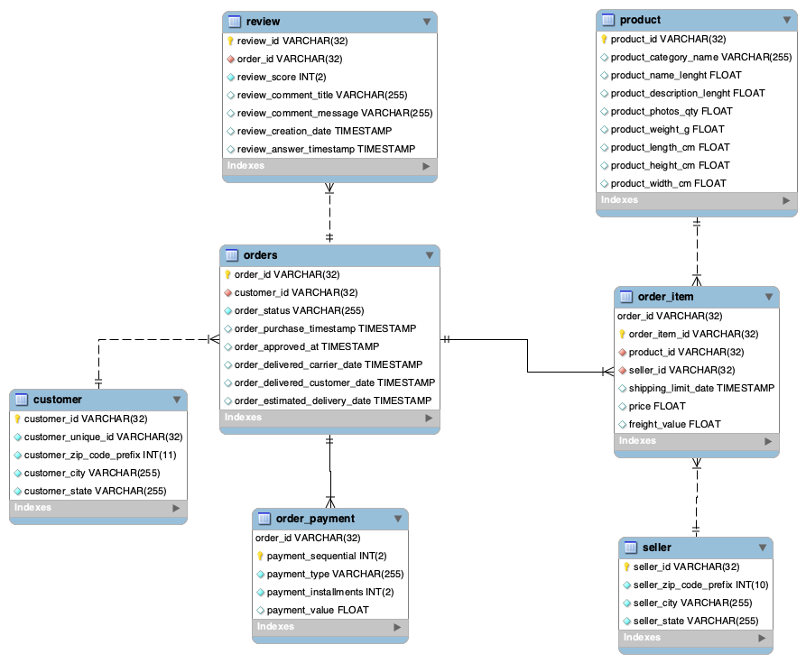
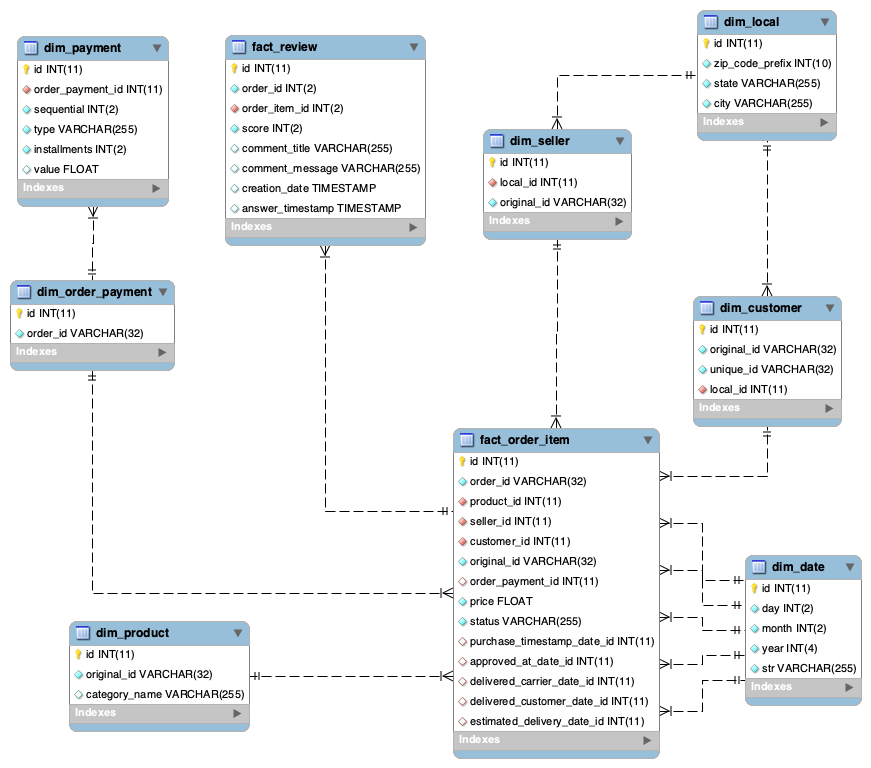

# ECommerceDW
Implementação de um DataWarehouse a partir do dataset disponibilizado pela Olist.

Dataset: https://www.kaggle.com/olistbr/brazilian-ecommerce

**Links utilizados:**
- https://sejaumdatascientist.com/como-fazer-modelagem-de-dados-para-data-engineering/
- https://stackoverflow.com/questions/2507289/time-and-date-dimension-in-data-warehouse
- https://towardsdatascience.com/building-a-modern-batch-data-warehouse-without-updates-7819bfa3c1ee

**Diagrama sourceDB:**

**Diagrama dw:**

